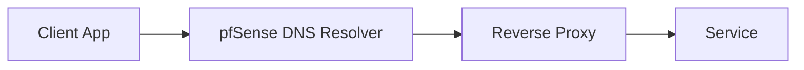

A common home network setup thing I've wanted to do for a long time was setting up local dns entries for services. Off the shelve routers have some limited capability to route to custom DNS servers how it is always inconsistent.

Now that I'm going for a more full stack home lab setup, I got an Intel N100 pfsense box to have more power over my local network.

Custom DNS is great for having logical names for services, instead of remembering port numbers. Especially in the context of wanting to play around with clusters.

# Basic flow



I'm choosing to refer to my services under the domain `home.lan`.

# Subdomain vs Paths

Effectively do you want to refer to services as `service.home.lan` or `home.lan/service`. Both as possible but paths require extra configuration of the service application to configure the base url.


# pfsense setup

Surprisingly, this has to be configured with pfsense DNS Resolver custom options.

```
server:
local-zone: "home.lan" redirect
local-data: "home.lan 86400 IN A 192.168.1.2"
```

This tell pfsense to forward any `home.lan` domain to my main server ip address.

Originally I had tried using Host and Domain overrides. But this then requires manual entry of each subdomain.

This can be tested using `nslookup`

```

❯ nslookup home.lan
Server:  pfSense.home.arpa
Address:  2607:fea8:1bdf:f12f:2d0:b4ff:fe04:d270

Name:    home.lan
Address:  192.168.1.2


❯ nslookup dashboard.home.lan
Server:  pfSense.home.arpa
Address:  2607:fea8:1bdf:f12f:2d0:b4ff:fe04:d270

Name:    dashboard.home.lan
Address:  192.168.1.2
```

# Setup Caddy Reverse Proxy

docker compose setup

```yaml
services:
  caddy:
    image: caddy:2
    container_name: caddy
    restart: unless-stopped
    ports:
      - "80:80"
      - "443:443"
    volumes:
      - ./Caddyfile:/etc/caddy/Caddyfile:ro
      - /srv/homelab/docker/caddy/data:/data
      - /srv/homelab/docker/caddy/config:/config
      - /srv/homelab/docker/caddy/logs:/var/log/caddy
    networks:
      - proxy

networks:
  proxy:
    driver: bridge
```


Now to setup the caddy file.

```conf
{
    # Global options
    email nnaraindev@gmail.com

    # Structured access logs
    log {
        output file /var/log/caddy/access.log
        format json
    }

    # Optional: increase limits for homelab workloads
    servers {
        max_header_size 16kb
    }
}

# Block direct IP access on 443
:443 {
    respond "Not Found" 404
}

# -----------------------------
# Internal services (.lan)
# -----------------------------
dashboard.home.lan {
        tls internal
        reverse_proxy 192.168.1.2:7575
}
```

Note the use of `tls intenal` is necessary for caddy to use its own self signed cert for https. Otherwise, browers will block the connection.

Now ideally this is directly using the docker container host name. But this is good enough for now.